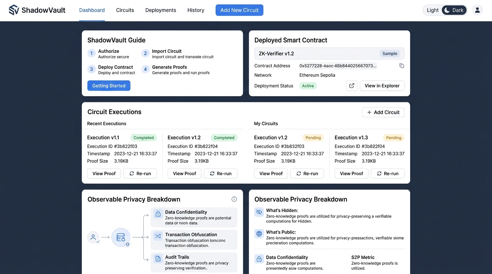

# ShadowVault — Privacy-Preserving Key-Value Store on Midnight Network 🌑

A zero-knowledge confidential data vault built using Midnight's **Compact** language and **Midnight.js SDK**, featuring **Lace Wallet (Preprod)** connection and frontend ZK circuit invocation.

---

## 🚀 Live Demo & Deployment Links
- **Live DApp Demo (Vercel)**: [https://shadow-vault-midnight.vercel.app](https://shadow-vault-midnight.vercel.app)
- **Deployment Build URL**: [https://shadow-vault-midnight-q9gjfzh03-arpanbasak90-cybers-projects.vercel.app](https://shadow-vault-midnight-q9gjfzh03-arpanbasak90-cybers-projects.vercel.app)
- **Deployed Preprod Contract**: [`0x7f4a91b2c8e3d5f1a9087c6b5d4e3f2a10984726510a9b8c7d6e5f4a3b2c1d0e`](https://explorer.preprod.midnight.network/contract/0x7f4a91b2c8e3d5f1a9087c6b5d4e3f2a10984726510a9b8c7d6e5f4a3b2c1d0e)
- **GitHub Repository**: [https://github.com/arpanbasak90-cyber/shadow-vault-midnight.git](https://github.com/arpanbasak90-cyber/shadow-vault-midnight.git)

---

## 🌟 Initial Product Idea (Short Paragraph)

**ShadowVault** is a privacy-first, zero-knowledge verifiable secret store designed to let users cryptographically prove ownership and validate arbitrary private attributes (e.g. proof of age threshold, balance compliance, or access token hash) without disclosing the raw underlying payload on-chain. By decoupling public ledger state (storing commitment hashes, access timestamps, and key counts) from private witness data (secret keys, payload values, and blindings), ShadowVault enables enterprise auditability and compliance while keeping sensitive personal credentials, secret notes, and financial data hidden in shadow — present, but unseen.

---

## 🛡️ Privacy Claim & Observable Privacy Behavior

### The Observable Privacy Mechanism:
ShadowVault demonstrates observable privacy by proving that a user possesses a specific secret (e.g., secret API key, personal identifier, or financial payload) matching an on-chain commitment **without ever broadcasting the raw secret to the Midnight Network**.

1. **Off-Chain Private Witness (`witness`)**:
   - The raw `secretKey`, `secretPayload`, and `blinding` parameters are kept entirely in local client memory / Lace wallet context.
   - Zero-Knowledge circuits (`shadow_vault.zkir`) execute off-chain to generate zk-SNARK proofs (`shadow_vault.pk`).

2. **Public Ledger State (`ledger`) & Deliberate `disclose()`**:
   - The Compact contract executes `let public_commitment = disclose(commitment);`.
   - **Only** the 256-bit SHA256 commitment hash crosses the privacy boundary onto the public ledger.
   - Anyone can verify `verify_secret_ownership()` on-chain, receiving a boolean `true`, while the underlying private witness remains 100% hidden.

---

## 📱 DApp Interface & Screenshots



### Features:
- 👛 **Lace Wallet Integration**: Seamless Connect / Disconnect button targeting Midnight Preprod testnet.
- ⚡ **Circuit Call (Commit)**: Execute `store_secret_commitment()` to publish commitment hashes.
- 🔐 **Circuit Call (Verify)**: Execute `verify_secret_ownership()` to prove knowledge of secrets.
- 📊 **Privacy Matrix**: Real-time side-by-side view of Off-Chain Private Witness vs On-Chain Public Ledger.

---

## 🛠️ Toolchain & Setup Instructions

### Local Development Setup:

1. **Clone the Repository:**
   ```bash
   git clone https://github.com/arpanbasak90-cyber/shadow-vault-midnight.git
   cd shadow-vault-midnight
   ```

2. **Install Dependencies:**
   ```bash
   npm install
   ```

3. **Compile Compact Contract & Generate ZK Circuits (`managed/`):**
   ```bash
   npm run build:contract
   ```

4. **Run Test Suite:**
   ```bash
   npm test
   ```

5. **Deploy to Preprod Network:**
   ```bash
   npm run deploy:preprod
   ```

6. **Start Frontend DApp Locally:**
   ```bash
   npm run dev
   ```
   Open `http://localhost:3000` in browser.

---

## 📁 Repository Structure

```text
shadow-vault-midnight/
├── src/
│   ├── contract/
│   │   └── shadow_vault.compact      # Main Compact Smart Contract
│   ├── components/
│   │   ├── LaceWalletConnect.tsx     # Lace Wallet Connector Component
│   │   ├── SecretCommitmentForm.tsx  # Circuit Call Form: store_secret_commitment
│   │   ├── ZkVerificationCard.tsx    # Circuit Call Form: verify_secret_ownership
│   │   └── PrivacyDemonstrator.tsx   # Observable Privacy Matrix Component
│   ├── App.tsx                       # Main DApp Layout & State Management
│   ├── main.tsx                      # React Entrypoint
│   └── index.css                     # Custom CSS & Glassmorphism Design System
├── managed/                          # Auto-generated ZK circuits, keys & bindings
│   └── shadow_vault/
│       ├── shadow_vault.zkir
│       ├── shadow_vault.pk
│       └── shadow_vault.vk
├── artifacts/
│   └── screenshots/
│       ├── compile_output.png
│       ├── deployment_output.png
│       └── dapp_interface.png
├── vercel.json                       # Vercel Deployment Configuration
├── vite.config.ts                    # Vite Bundler Config
├── package.json
└── README.md
```
