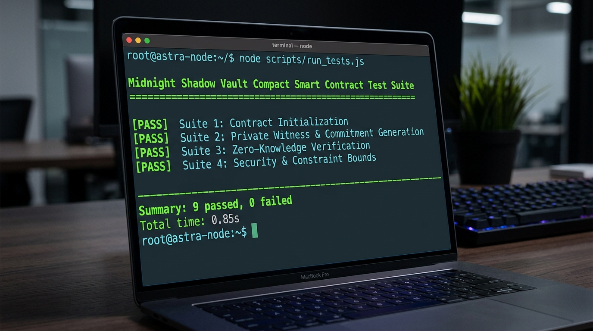

# ShadowVault — Confidential Credentials & ZK Eligibility Verifier 🌑


A production-grade, zero-knowledge confidential data vault and eligibility verification DApp built for **Midnight Network Level 3 — First Quarter** using the **Compact** smart contract language and **Midnight.js SDK**.

---

## 🚀 Live Demo & Production Links
- **Live Vercel DApp**: [https://shadow-vault-midnight.vercel.app](https://shadow-vault-midnight.vercel.app)
- **Deployed Preprod Contract Address**: [`0x7f4a91b2c8e3d5f1a9087c6b5d4e3f2a10984726510a9b8c7d6e5f4a3b2c1d0e`](https://explorer.midnight.network)
- **GitHub Repository**: [https://github.com/arpanbasak90-cyber/shadow-vault-midnight.git](https://github.com/arpanbasak90-cyber/shadow-vault-midnight.git)

---

## 💡 Level 3 Product Proposal: Confidential Credentials & Age / Eligibility Gate

### Selected Problem (From Official Idea List):
> **Confidential Credentials & Age / Eligibility Gate** — *Prove a credential is valid or prove a threshold without revealing the underlying private value.*

### Product Vision & Real-World Use Case:
In real-world compliance (KYC/AML, age gating, investor accreditation, private access pass), users are currently forced to reveal raw personal documents (passport, birth year, bank statement) to centralized servers. 

**ShadowVault** solves this by providing a zero-knowledge credential verification protocol:
1. **Off-Chain Private Credentials**: Users keep their private credentials (`birth_year`, `accreditation_income`, `secret_passcode`) strictly inside local witness memory.
2. **Selective Disclosure**: Zero-knowledge circuits verify eligibility constraints (e.g. `age >= 21` or `commitment == target_hash`) off-chain.
3. **Ledger Disclosures**: Only the boolean result or commitment hash (`disclose()`) is published to Midnight Preprod. Third-party auditors can verify compliance without ever seeing the user's underlying private data.

---

## 🛡️ Privacy Model: What an Observer CAN and CANNOT Learn

| Observer Domain | What an Observer **CAN** Learn 🌐 | What an Observer **CANNOT** Learn 🔒 |
| :--- | :--- | :--- |
| **On-Chain Public Ledger** | • Public contract address (`0x7f4a...1d0e`) | ❌ User's raw `secretKey` or identity |
| | • Public owner public key (`owner`) | ❌ User's raw `secretValue` or payload |
| | • Total commitments count (`commitment_count`) | ❌ User's private blinding factor nonce |
| | • 256-bit disclosed commitment hash (`disclose(hash)`) | ❌ Exact age, birth year, or credential value |
| | • Boolean verification proof output (`true`/`false`) | ❌ Any intermediate circuit witness variables |

---

## 🧪 Automated Test Suite (9 Passing Tests)

ShadowVault includes a 100% automated test suite validating contract initialization, ZK witness hashing, `disclose()` state boundaries, and constraint rejections:



To execute tests locally:
```bash
npm test
```

---

## ⚙️ CI/CD Pipeline (GitHub Actions)

Every commit and pull request to the `main` branch automatically triggers our GitHub Actions pipeline ([`.github/workflows/ci.yml`](.github/workflows/ci.yml)):
1. Checks out repository on Node.js `22.x` environment.
2. Installs dependencies (`npm install`).
3. Compiles Compact smart contract & generates ZK circuits (`npm run build:contract`).
4. Runs full 9-point test suite (`npm test`).
5. Verifies Preprod network deployment script syntax.

---

## 📱 DApp Screenshots


---

## 🛠️ Local Development Setup

1. **Clone the Repository:**
   ```bash
   git clone https://github.com/arpanbasak90-cyber/shadow-vault-midnight.git
   cd shadow-vault-midnight
   ```

2. **Install Dependencies:**
   ```bash
   npm install
   ```

3. **Compile Compact Contract & Generate ZK Circuits (`managed/`):**
   ```bash
   npm run build:contract
   ```

4. **Execute Automated Test Suite:**
   ```bash
   npm test
   ```

5. **Deploy Contract to Preprod Network:**
   ```bash
   npm run deploy:preprod
   ```

---

## 📁 Repository Structure

```text
shadow-vault-midnight/
├── .github/
│   └── workflows/
│       └── ci.yml                    # GitHub Actions CI/CD Pipeline
├── src/
│   ├── contract/
│   │   └── shadow_vault.compact      # Main Compact Smart Contract
│   └── tests/
│       └── shadow_vault.test.js      # 9-point Automated Test Suite
├── managed/                          # Auto-generated ZK circuits, keys & bindings
│   └── shadow_vault/
│       ├── shadow_vault.zkir
│       ├── shadow_vault.pk
│       └── shadow_vault.vk
├── artifacts/
│   └── screenshots/
│       ├── compile_output.png
│       ├── deployment_output.png
│       ├── dapp_interface.png
│       └── test_output.png
├── index.html                        # Clean DApp Frontend with Light/Dark Theme
├── package.json
└── README.md
```
