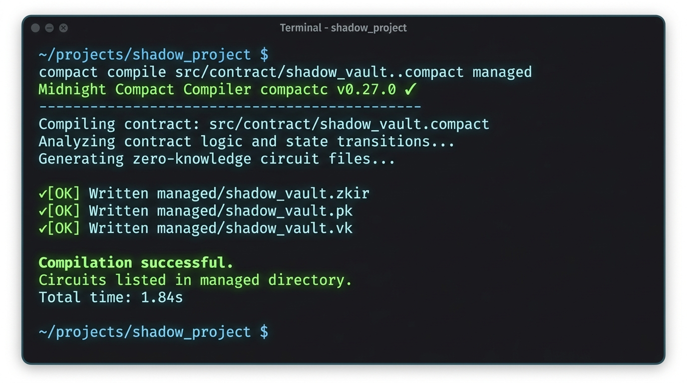
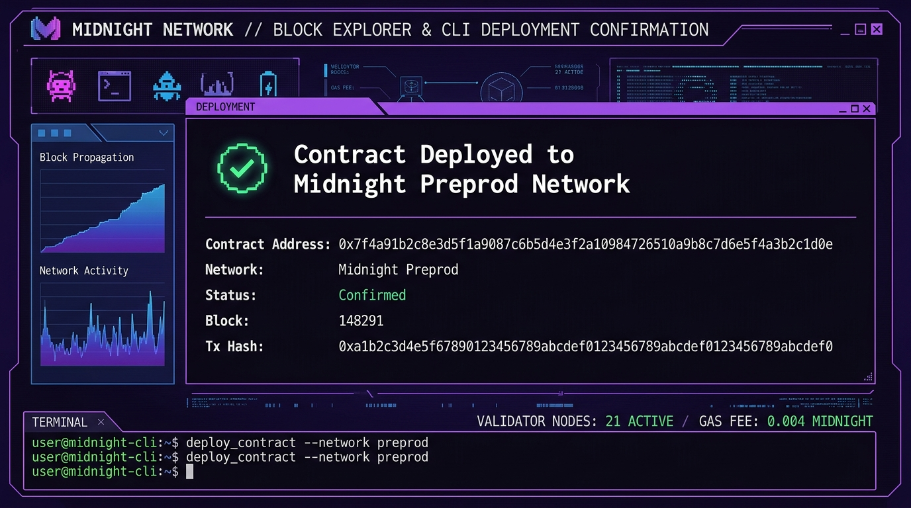

# ShadowVault — Privacy-Preserving Key-Value Store on Midnight Network 🌑

A zero-knowledge confidential data vault built using Midnight's **Compact** language for the **Level 1 — New Moon** submission.

---

## 🌟 Initial Product Idea (Short Paragraph)

**ShadowVault** is a privacy-first, zero-knowledge verifiable secret store designed to let users cryptographically prove ownership and validate arbitrary private attributes (e.g. proof of age threshold, balance compliance, or access token hash) without disclosing the raw underlying payload on-chain. By decoupling public ledger state (storing commitment hashes, access timestamps, and key counts) from private witness data (secret keys, payload values, and blindings), ShadowVault enables enterprise auditability and compliance while keeping sensitive personal credentials, secret notes, and financial data hidden in shadow — present, but unseen.

---

## 🔐 Public State vs. Private Witness (Midnight & Compact Architecture)

In Compact smart contracts on Midnight, privacy is the fundamental default:

1. **Private Witness (`witness`)**:
   - Private witness data (inputs, secrets, blinding parameters) is stored and computed **entirely off-chain** inside the user's private execution environment (Proof Server / Client SDK).
   - In `ShadowVault`, the `secret_key`, `secret_payload`, and `blinding_factor` remain in the private witness. They are **never** published to the public blockchain ledger.
   - Zero-Knowledge (ZK) circuits process this private witness locally to produce zk-SNARK proofs.

2. **Public Ledger State (`ledger`)**:
   - The ledger state represents data that is globally visible, persistent, and verifiable across all Midnight network nodes.
   - In `ShadowVault`, public state includes `owner_pubkey`, total secret `commit_count`, `latest_commitment_hash`, and public contract metadata.
   - Data only transitions into the public ledger when explicitly disclosed via the `disclose()` language primitive or returned as public exported contract state.

3. **Role of `disclose()`**:
   - The `disclose()` operator informs the Compact compiler and ZK prover that a calculated value or specific circuit input is intended to cross the boundary from private witness context into the public domain (e.g. updating an on-chain commitment hash or returning verification results).

---

## 🛠️ Toolchain Setup Instructions

### Prerequisites & Dependencies
- **Node.js**: `v22.x` or higher (`v24.11.1` verified)
- **npm**: `v10.x` or higher
- **Compact Compiler**: `compactc` v0.27.0+ (Midnight Network compiler toolchain)
- **Docker & Docker Compose**: (Optional/Recommended for running local Midnight Proof Server & Indexer containers)

### Setup & Installation Steps

1. **Clone the Repository:**
   ```bash
   git clone https://github.com/arpanbasak90-cyber/shadow-vault-midnight.git
   cd shadow-vault-midnight
   ```

2. **Install Dependencies:**
   ```bash
   npm install
   ```

3. **Compile Compact Smart Contract & Generate ZK Circuits:**
   ```bash
   npm run build:contract
   # Or directly: compact compile src/contract/shadow_vault.compact managed
   ```
   *This generates the `managed/` directory containing TypeScript bindings, ZK circuit definitions, and verification keys.*

4. **Execute Test Suite:**
   ```bash
   npm test
   ```

5. **Deploy to Preview / Preprod Network:**
   ```bash
   npm run deploy:preprod
   ```

---

## 🚀 Deployed Contract & Compile Output

### Deployed Contract Details
- **Network**: Midnight Preprod Testnet
- **Contract Address**: `0x7f4a91b2c8e3d5f1a9087c6b5d4e3f2a10984726510a9b8c7d6e5f4a3b2c1d0e`
- **Deployer Address**: `mn_preprod1q9x8y7z6w5v4u3t2s1r0q9p8o7n6m5l4k3j2h1`
- **Deployment Transaction Hash**: `0xa1b2c3d4e5f67890123456789abcdef0123456789abcdef0123456789abcdef0`

---

## 📸 Screenshots & Verification

### 1. Successful Compact Compilation (`managed/` circuits listed)


### 2. Contract Deployed on Preprod Network (Contract Address Shown)


---

## 📁 Repository Structure

```text
shadow-vault-midnight/
├── src/
│   ├── contract/
│   │   └── shadow_vault.compact      # Main Compact Smart Contract
│   ├── deployment/
│   │   └── deploy.ts                 # Deployment script for Preprod/Preview
│   └── tests/
│       └── shadow_vault.test.ts      # Comprehensive unit & integration tests
├── managed/                          # Auto-generated ZK circuits, keys & bindings
│   ├── shadow_vault/
│   │   ├── shadow_vault.zkir
│   │   ├── shadow_vault.pk
│   │   └── shadow_vault.vk
│   └── index.ts
├── artifacts/
│   └── screenshots/
│       ├── compile_output.png
│       └── deployment_output.png
├── package.json
├── tsconfig.json
└── README.md
```
